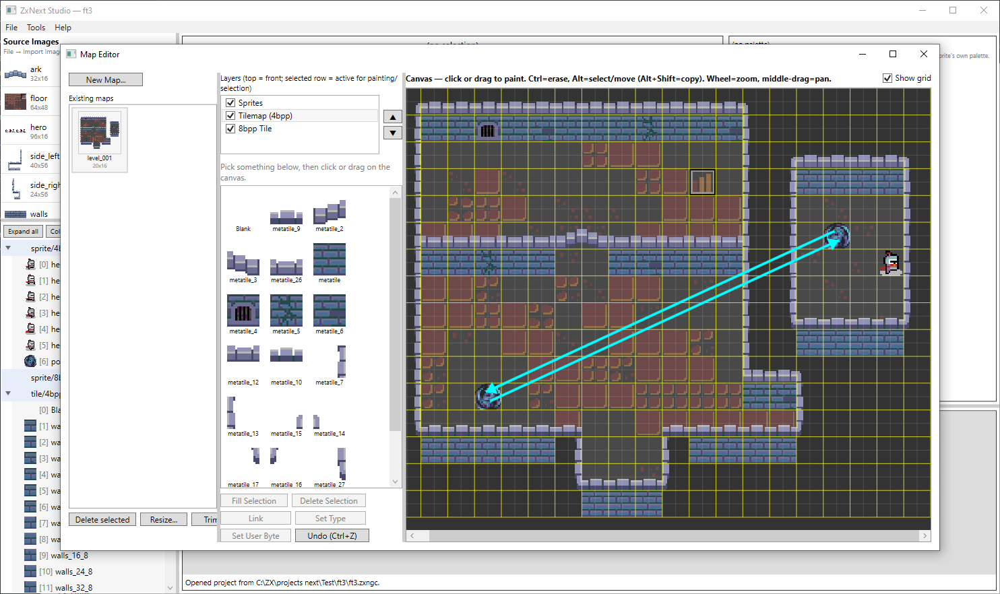
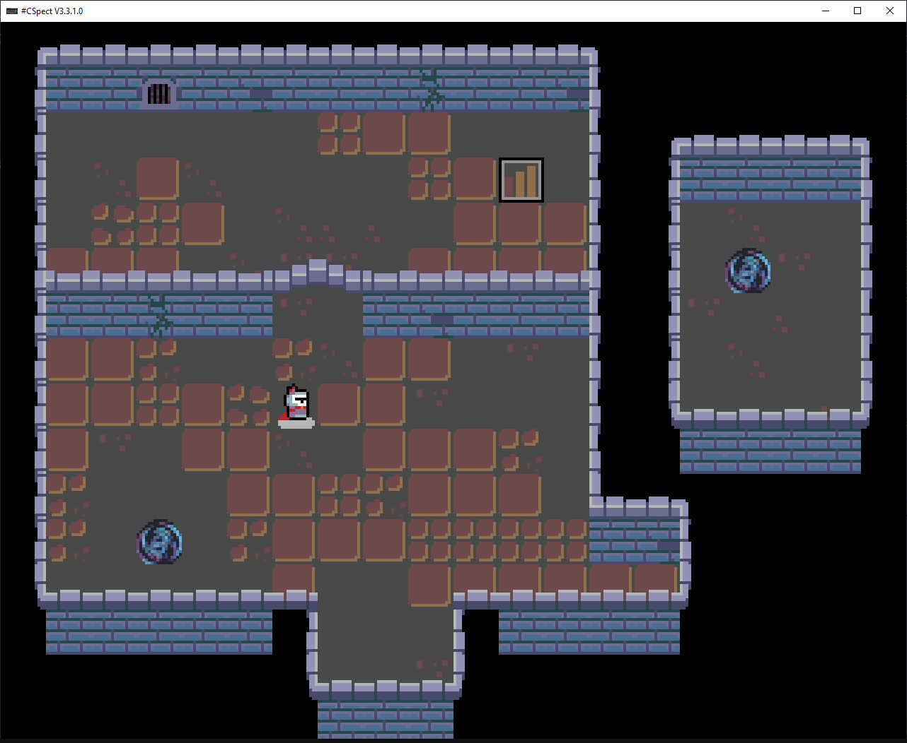

# ZxNextStudio-TechDemo

A small ZX Spectrum Next tech demo showing off data exported from **[ZxNext Studio](https://github.com/serdjukdev/ZxNextGraphicsConverter)**, a graphics/map converter and editor for ZX Next projects.

The code itself was written quickly to demonstrate the exported data working in practice, it makes no claim to being clean or original, just functional.

## What it demonstrates

- Rendering all three exported layers at once: **Tilemap** (4bpp), **Layer 2** (8bpp), and **Sprites**.
- An animated player character, movable with the classic **Q/A/O/P** Spectrum controls (Q/A = up/down, O/P = left/right).
- **Wall collision** against the tilemap.
- **Object links**, exported from ZxNext Studio's Link tool: walking into a portal object teleports the player to whichever object it's linked to, a second portal placed elsewhere on the map.

## Requirements

To build and run this project you need:

- **[sjasmplus](https://github.com/z00m128/sjasmplus)**, the Z80 assembler used to build the ROM/NEX file.
- **[CSpect](https://mdf200.itch.io/cspect)**, a ZX Spectrum Next emulator, used to run the built `.nex` file.
- Visual Studio Code (the build is wired up as a VS Code task).

## Setup

1. Download sjasmplus and CSpect (links above) and unpack them anywhere on your machine.
2. Open `.vscode/tasks.json` and point the two hardcoded paths at your own install locations:
   - the `sjasmplus` task's `command` field, path to `sjasmplus.exe`
   - the `Build` task's `command` field, path to `CSpect.exe`
3. Open this folder in VS Code.
4. Press `Ctrl+Shift+B` (or run the "Build" task). This chains: bump the version number, assemble with sjasmplus, then launch the result in CSpect.

The built `.nex` file ends up in `build/game.nex`.

## Project layout

- `code/`: Z80 source (`launcher.asm` is the entry point; `render/` has the tilemap/Layer 2/sprite renderers, plus input and collision).
- `data/Test/`: graphics and map data exported from ZxNext Studio (tiles, sprites, palettes, tilemap/Layer 2 grids and metatiles, object placements and types).
- `build/`: build output (`game.nex`).

## Credits

All graphics and map data were authored and exported with **[ZxNext Studio](https://github.com/serdjukdev/ZxNextGraphicsConverter)**.

## License

[MIT](LICENSE)
